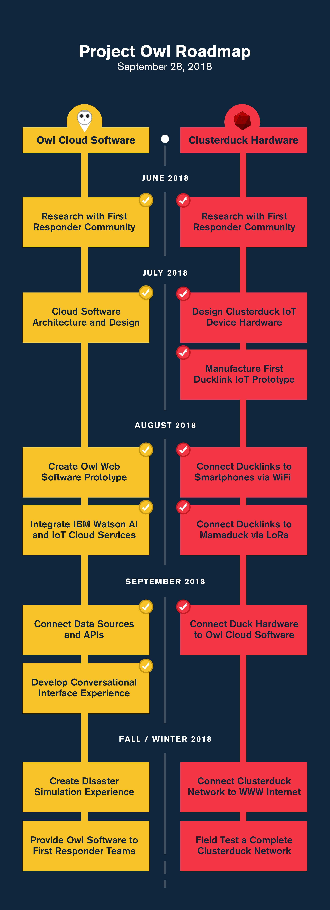

[](https://www.apache.org/licenses/LICENSE-2.0) [](https://developer.ibm.com/callforcode/solutions/projects/get-started/)
[](https://github.com/KOSASIH/InterFarmatica/actions/workflows/jekyll-docker.yml)
[](https://github.com/KOSASIH/InterFarmatica/actions/workflows/codeql.yml)
[](https://github.com/KOSASIH/InterFarmatica/actions/workflows/sample_react_app_pr_ci.yaml)
[](https://github.com/KOSASIH/InterFarmatica/actions/workflows/greetings.yml)

# InterFarmatica 

Interfarmatica is a healthcare microservice supply chain system that aims to revolutionize the pharmaceutical industry by leveraging microservices architecture and modern technologies.

- [Project summary](#project-summary)
  - [The issue we are hoping to solve](#the-issue-we-are-hoping-to-solve)
  - [How our technology solution can help](#how-our-technology-solution-can-help)
  - [Our idea](#our-idea)
- [Technology implementation](#technology-implementation)
  - [IBM AI service(s) used](#ibm-ai-services-used)
  - [Other IBM technology used](#other-ibm-technology-used)
  - [Solution architecture](#solution-architecture)
- [Presentation materials](#presentation-materials)
  - [Solution demo video](#solution-demo-video)
  - [Project development roadmap](#project-development-roadmap)
- [Additional details](#additional-details)
  - [How to run the project](#how-to-run-the-project)
  - [Live demo](#live-demo)
- [About this template](#about-this-template)
  - [Contributing](#contributing)
  - [Versioning](#versioning)
  - [Authors](#authors)
  - [License](#license)
  - [Acknowledgments](#acknowledgments)

## Project summary

InterFarmatica is a groundbreaking healthcare microservice supply chain system designed to transform the pharmaceutical industry. By harnessing the power of microservices architecture and cutting-edge technologies, InterFarmatica aims to streamline and modernize the way pharmaceutical products are manufactured, distributed, and managed. This innovative platform promises to enhance efficiency, transparency, and collaboration within the industry, ultimately leading to improved patient care and outcomes.

### The issue we are hoping to solve

InterFarmatica seeks to address the longstanding challenges within the pharmaceutical industry, such as inefficient supply chain processes, lack of real-time visibility into product distribution, and limited interoperability between different stakeholders. By leveraging microservices architecture and modern technologies, the project aims to revolutionize these aspects, fostering a more agile, transparent, and interconnected pharmaceutical ecosystem.


### How our technology solution can help

InterFarmatica's technology solution offers a multi-faceted approach to address the pharmaceutical industry's challenges. Through its microservices architecture, the system enables modular and scalable components, allowing for rapid development, easy integration, and flexibility in adapting to evolving needs. Real-time data sharing and analytics enhance visibility and decision-making across the supply chain, minimizing delays and optimizing inventory management. By facilitating seamless communication between manufacturers, distributors, healthcare providers, and regulatory authorities, InterFarmatica fosters collaboration, reduces errors, and ensures a more efficient flow of pharmaceutical products from production to patient, ultimately improving patient care and operational efficiency.


### Our idea

InterFarmatica, revolves around creating a healthcare microservice supply chain system that employs modern technologies and microservices architecture to transform the pharmaceutical industry. By utilizing this innovative approach, we aim to streamline processes, enhance transparency, and foster collaboration among stakeholders, ultimately revolutionizing how pharmaceutical products are manufactured, distributed, and managed. This forward-thinking concept has the potential to significantly improve efficiency, reduce errors, and contribute to better patient care outcomes within the healthcare ecosystem.


More detail is available in our [description document](./docs/DESCRIPTION.md).

## Technology implementation

InterFarmatica's technology implementation involves the following key components:

1. **Microservices Architecture:** The system is designed with a modular approach, where different functions are broken down into smaller, independently deployable microservices. This promotes flexibility, scalability, and ease of maintenance.

2. **Cloud Infrastructure:** Leveraging cloud services enables efficient scaling of resources, ensuring optimal performance during varying demand periods while minimizing infrastructure costs.

3. **Real-time Data Integration:** InterFarmatica integrates with various data sources, including manufacturing facilities, warehouses, distributors, and healthcare providers. Real-time data synchronization ensures accurate and up-to-date information across the supply chain.

4. **Blockchain and Smart Contracts:** Implementing blockchain technology enhances data security, traceability, and accountability. Smart contracts automate and validate processes, reducing the risk of errors and disputes.

5. **Advanced Analytics and AI:** Utilizing data analytics and AI algorithms provides insights into demand forecasting, inventory optimization, and supply chain trends, enabling proactive decision-making.

6. **APIs and Interoperability:** Open APIs facilitate seamless communication between different stakeholders, allowing for easy integration with existing systems and promoting interoperability.

7. **User-friendly Interfaces:** Intuitive interfaces for manufacturers, distributors, healthcare providers, and regulatory authorities ensure smooth interactions and user adoption.

8. **Cybersecurity Measures:** Robust cybersecurity protocols protect sensitive data and ensure compliance with industry regulations.

9. **Continuous Monitoring and Improvement:** Regular monitoring, feedback loops, and iterative updates ensure the system remains efficient, reliable, and aligned with evolving industry needs.

By implementing these technological elements, InterFarmatica aims to create a cohesive and transformative solution for the pharmaceutical supply chain, fostering efficiency, transparency, and collaboration throughout the ecosystem.

### IBM AI service(s) used

 
- [IBM Natural Language Understanding](https://cloud.ibm.com/catalog/services/natural-language-understanding) - IBM Natural Language Understanding (NLU) can play a crucial role in enhancing various aspects of your InterFarmatica solution within the pharmaceutical supply chain. Here are some potential use cases for incorporating IBM NLU:

1. **Demand Analysis and Forecasting:** NLU can analyze text data from sources like medical literature, patient records, and social media to understand trends, sentiments, and emerging healthcare needs. This information can help predict demand for specific pharmaceutical products and guide inventory management.

2. **Regulatory Compliance:** NLU can extract key insights from regulatory documents and guidelines, ensuring that the pharmaceutical supply chain adheres to compliance standards and regulatory changes.

3. **Quality Control and Product Reviews:** By analyzing customer feedback, reviews, and complaints, NLU can provide insights into product quality and patient satisfaction. This data can inform quality control measures and contribute to continuous improvement.

4. **Risk Assessment:** NLU can help identify and assess potential risks within the supply chain, such as disruptions in production or distribution. This proactive approach allows for timely mitigation strategies.

5. **Market Research:** NLU can analyze market reports, competitor information, and news articles to provide insights into market trends, competitive landscape, and opportunities for product expansion.

6. **Supplier and Partner Analysis:** NLU can assist in evaluating potential suppliers and partners by analyzing their online presence, reputation, and customer feedback, helping to make informed decisions about collaborations.

7. **Automated Customer Support:** NLU-powered chatbots or virtual assistants can provide real-time customer support, answering queries and resolving issues related to pharmaceutical products, orders, and deliveries.

8. **Clinical Trials Data Analysis:** NLU can extract relevant information from clinical trial reports and research papers, aiding in the assessment of drug effectiveness, safety, and potential side effects.

9. **Knowledge Base Development:** NLU can help in building a comprehensive knowledge base by extracting and categorizing information from medical literature, research papers, and industry reports.

To incorporate IBM NLU into InterFarmatica, you would integrate the service's API into your system. The API allows you to analyze text data, extract entities, sentiments, concepts, keywords, and more. By leveraging NLU, you can gain deeper insights from textual data, enabling more informed decision-making and improved overall efficiency within the pharmaceutical supply chain.

- [Watson Assistant](https://cloud.ibm.com/catalog/services/watson-assistant) - IBM Watson Assistant can be utilized within your InterFarmatica solution to enhance user interaction, provide real-time support, and streamline various processes within the pharmaceutical supply chain. Here are some potential use cases for incorporating IBM Watson Assistant:

1. **User Onboarding and Training:** Watson Assistant can guide users, such as pharmaceutical manufacturers, distributors, and healthcare providers, through the platform's features and functionalities during the onboarding process, ensuring a smooth transition and efficient utilization.

2. **Order Tracking and Status:** Users can interact with a Watson Assistant chatbot to inquire about the status of their orders, expected delivery dates, and any potential delays, providing them with timely and accurate information.

3. **Product Information and Queries:** Healthcare professionals can use the Watson Assistant to inquire about specific pharmaceutical products, their ingredients, usage guidelines, potential interactions, and side effects, aiding in informed decision-making.

4. **Inventory Management:** Users can interact with Watson Assistant to check current inventory levels, request restocking, and receive recommendations for optimizing inventory management based on demand patterns.

5. **Compliance and Regulatory Queries:** Watson Assistant can provide information about regulatory guidelines, compliance requirements, and documentation needed for various stages of the pharmaceutical supply chain.

6. **Troubleshooting and Issue Resolution:** Watson Assistant can offer troubleshooting guidance and step-by-step instructions to resolve common issues that users might encounter while using the InterFarmatica platform.

7. **Collaboration and Communication:** Watson Assistant can facilitate communication between different stakeholders by scheduling meetings, sending notifications, and assisting with information exchange.

8. **Data Entry and Updates:** Users can interact with Watson Assistant to enter or update data within the system, such as product details, manufacturing processes, and distribution information.

9. **Feedback Collection:** Watson Assistant can gather user feedback and suggestions, helping to continuously improve the platform based on user input.

To integrate IBM Watson Assistant into your solution, you would configure and train the assistant to understand specific intents, user queries, and provide relevant responses. The integration can be achieved through APIs, allowing the chatbot to interact with users through text or voice interfaces within the InterFarmatica platform. This AI-powered virtual assistant can enhance user engagement, provide instant support, and contribute to a more seamless and user-friendly pharmaceutical supply chain ecosystem. 

- [Watson Discovery](https://cloud.ibm.com/catalog/services/watson-discovery) - IBM Watson Discovery can be strategically incorporated into your InterFarmatica solution to extract valuable insights from vast amounts of unstructured data, enhancing decision-making and efficiency within the pharmaceutical supply chain. Here are several ways you can use Watson Discovery within your solution:

1. **Medical Literature and Research Analysis:** Watson Discovery can analyze scientific articles, medical literature, and research papers to extract relevant information about pharmaceutical compounds, treatment protocols, and clinical trial outcomes. This data can inform product development and decision-making processes.

2. **Regulatory Document Extraction:** Watson Discovery can automatically extract key details from regulatory documents, such as drug approvals, safety guidelines, and labeling requirements. This ensures that the pharmaceutical supply chain remains compliant with changing regulations.

3. **Competitive Intelligence:** Watson Discovery can gather and analyze information from news articles, press releases, and industry reports to provide insights into competitors' activities, market trends, and emerging opportunities.

4. **Market and Trend Analysis:** By processing online articles, social media discussions, and market reports, Watson Discovery can identify emerging trends, patient preferences, and shifts in demand, enabling better anticipation of market changes.

5. **Clinical Trial Data Insights:** Watson Discovery can extract structured data from clinical trial reports, identifying patient demographics, treatment outcomes, adverse events, and efficacy results. This data supports evidence-based decision-making and product development strategies.

6. **Supplier and Partner Evaluation:** Watson Discovery can assist in evaluating potential suppliers and partners by analyzing their online presence, news coverage, and customer feedback. This helps ensure reliable and reputable collaborations.

7. **Knowledge Base Creation:** Use Watson Discovery to build a comprehensive knowledge base by extracting and categorizing information from a wide range of sources, creating a valuable resource for users within the InterFarmatica ecosystem.

8. **Search and Retrieval:** Implement Watson Discovery's powerful search capabilities to quickly retrieve relevant information from documents, reports, and other textual sources, saving time and effort for users seeking specific insights.

To integrate IBM Watson Discovery into your solution, you would configure and train the service to understand your specific data sources, entities, and information retrieval needs. The service can be accessed through APIs, allowing you to perform advanced text analytics and retrieve structured insights from unstructured data within the InterFarmatica platform. By leveraging Watson Discovery, you can tap into the wealth of information present in various textual sources, enhancing data-driven decision-making and fostering a more informed and efficient pharmaceutical supply chain ecosystem.

- [Watson Speech to Text](https://cloud.ibm.com/catalog/services/speech-to-text) - IBM Watson Speech to Text can be a valuable addition to your InterFarmatica solution, enhancing accessibility, communication, and data capture within the pharmaceutical supply chain. Here are several scenarios where Watson Speech to Text can be used effectively:

1. **Voice Commands and Control:** Incorporate voice recognition capabilities using Watson Speech to Text to allow users to interact with the InterFarmatica platform through spoken commands, making it easier to navigate and perform tasks hands-free.

2. **Voice Data Entry:** Enable users to input data into the system by speaking, reducing the need for manual typing and accelerating data entry processes, especially in scenarios where users need to provide updates on the go.

3. **Field Data Collection:** Field workers, such as pharmaceutical inspectors and supply chain managers, can use Watson Speech to Text to dictate observations, findings, and quality assessments while conducting on-site inspections or audits.

4. **Hands-free Documentation:** Healthcare professionals and researchers can verbally document observations, patient case notes, and experimental results, ensuring accurate and detailed records without interrupting their workflow.

5. **Call Transcriptions:** Use Watson Speech to Text to transcribe phone calls and discussions related to product orders, supply chain updates, and customer interactions, maintaining accurate records and facilitating follow-up actions.

6. **Conference and Meeting Notes:** Automatically transcribe meetings, workshops, and conferences, capturing discussions related to product development, regulatory compliance, and strategic planning for future reference.

7. **Voice Alerts and Notifications:** Implement voice notifications and alerts to keep users informed about critical updates, supply chain disruptions, or regulatory changes, enhancing real-time communication.

8. **Language Translation:** Integrate Watson Language Translator with Speech to Text to facilitate multilingual communication, enabling users from different regions to interact seamlessly within the InterFarmatica ecosystem.

To integrate IBM Watson Speech to Text into your solution, you would process audio recordings or live voice input through the service's API. The service converts spoken language into written text, which can then be processed, analyzed, and stored within the InterFarmatica platform. By incorporating voice recognition capabilities, you can enhance user experience, data capture efficiency, and overall communication within the pharmaceutical supply chain, contributing to a more effective and user-friendly ecosystem.

- [Watson Text to Speech](https://cloud.ibm.com/catalog/services/text-to-speech) - IBM Watson Text to Speech can be effectively integrated into your InterFarmatica solution to enhance communication, accessibility, and user engagement across various aspects of the pharmaceutical supply chain. Here are some scenarios where Watson Text to Speech can be utilized:

1. **Auditory Alerts and Notifications:** Implement auditory alerts and notifications to keep users informed about important updates, such as supply chain disruptions, order status changes, or regulatory announcements.

2. **Voice-guided Workflows:** Provide step-by-step voice instructions to guide users through complex processes, such as manufacturing procedures, quality control checks, and distribution logistics.

3. **Hands-free Reports and Updates:** Enable users to listen to reports, updates, and summaries while on the move, allowing them to stay informed without needing to read lengthy documents.

4. **Voice-based Documentation:** Convert textual information, such as product specifications, safety guidelines, and regulatory documentation, into spoken audio formats for easier consumption by users.

5. **Multilingual Communication:** Use Watson Text to Speech in combination with translation services to deliver information in multiple languages, accommodating a diverse user base across different regions.

6. **Accessibility Features:** Provide text-to-speech functionality for users with visual impairments or reading difficulties, ensuring that critical information is accessible to all stakeholders.

7. **Interactive Voice Interfaces:** Create interactive voice interfaces that allow users to interact with the InterFarmatica platform using spoken commands, making it more user-friendly and intuitive.

8. **Training and Onboarding:** Utilize voice-based training modules and tutorials to guide new users through the features and functionalities of the InterFarmatica system.

To integrate IBM Watson Text to Speech into your solution, you would utilize the service's API to convert text into natural-sounding audio. The generated audio can be delivered to users through various channels, such as web interfaces, mobile apps, or even integrated into physical devices within the pharmaceutical supply chain.

By incorporating text-to-speech capabilities, you can enhance communication, accessibility, and user engagement within the InterFarmatica ecosystem, creating a more inclusive and user-friendly experience for all stakeholders involved.

### Other IBM technology used

INSTRUCTIONS: List any other IBM technology used in your solution and describe how each component was used. If you can provide links to/details on exactly where these were used in your code, that would help the judges review your submission.

### Solution architecture

Diagram and step-by-step description of the flow of our solution:


1. The user navigates to the site and uploads a video file.
2. Watson Speech to Text processes the audio and extracts the text.
3. Watson Translation (optionally) can translate the text to the desired language.
4. The app stores the translated text as a document within Object Storage.

## Presentation materials

_INSTRUCTIONS: The following deliverables should be officially posted to your My Team > Submissions section of the [Call for Code Global Challenge resources site](https://cfc-prod.skillsnetwork.site/), but you can also include them here for completeness. Replace the examples seen here with your own deliverable links._

### Solution demo video

[](https://youtu.be/vOgCOoy_Bx0)

### Project development roadmap


The project development roadmap for InterFarmatica involves laying out the key milestones, tasks, and timelines required to bring your healthcare microservices supply chain system to life. Here is the structure of the InterFarmatica roadmap :

**Phase 1: Project Initiation and Planning (Duration: 2 months)**

1. Define Project Scope and Objectives
2. Conduct Stakeholder Analysis and Engagement
3. Identify Key Technology Components and IBM AI Services
4. Create High-Level System Architecture
5. Develop Project Plan and Timeline
6. Allocate Resources and Set Budget

**Phase 2: System Design and Architecture (Duration: 3 months)**

1. Finalize Microservices Architecture Design
2. Design Cloud Infrastructure and Integration Points
3. Plan Real-Time Data Integration Mechanisms
4. Define Blockchain Implementation Strategy
5. Architect Analytics and AI Integration
6. Create User Interface and Experience Designs

**Phase 3: Development and Implementation (Duration: 6 months)**

1. Develop Microservices and Cloud Infrastructure
2. Implement Real-Time Data Integration Processes
3. Build and Test Blockchain and Smart Contracts
4. Develop AI Models and Implement Analytics
5. Create User Interfaces and Front-End Components
6. Conduct Iterative Testing and Quality Assurance

**Phase 4: Integration and Testing (Duration: 2 months)**

1. Integrate Microservices and Data Flows
2. Test End-to-End Functionality
3. Conduct Performance and Scalability Testing
4. Validate Interoperability with External Systems
5. Test AI Services Integration and Accuracy

**Phase 5: User Testing and Feedback (Duration: 2 months)**

1. Conduct User Acceptance Testing (UAT)
2. Gather User Feedback and Iteratively Improve
3. Address User Interface and Experience Enhancements
4. Refine AI Service Configurations and Models

**Phase 6: Deployment and Launch (Duration: 1 month)**

1. Prepare for Production Deployment
2. Migrate Data and Set Up Live Environment
3. Perform Final System Testing and Validation
4. Launch InterFarmatica to Target Users
5. Monitor Initial Performance and User Experience

**Phase 7: Continuous Improvement and Expansion (Ongoing)**

1. Monitor System Performance and User Adoption
2. Collect and Analyze Data for Insights
3. Implement Ongoing Enhancements and Updates
4. Explore Expansion to New Markets or Features
5. Foster Collaborations and Partnerships

**Phase 8: Partnerships and Collaborations (Duration: Ongoing)**

1. Identify potential partners, including pharmaceutical manufacturers, distributors, healthcare providers, and regulatory bodies.
2. Establish collaborations to enhance data sharing, interoperability, and knowledge exchange within the pharmaceutical ecosystem.

**Phase 9: Data Privacy and Security Enhancements (Duration: 3 months)**

1. Implement advanced encryption techniques to safeguard sensitive data during transmission and storage.
2. Develop robust access control mechanisms to ensure data is only accessible to authorized users.
3. Conduct regular security audits and vulnerability assessments to identify and address potential risks.

**Phase 10: Mobile Application Development (Duration: 4 months)**

1. Create a mobile application for InterFarmatica, enabling users to access critical information and perform tasks on-the-go.
2. Design intuitive user interfaces optimized for mobile devices to enhance user experience.

**Phase 11: Regulatory Compliance Automation (Duration: 5 months)**

1. Develop AI-driven algorithms to automate the monitoring and adherence to regulatory guidelines.
2. Implement real-time alerts and notifications to keep stakeholders informed about regulatory changes.

**Phase 12: Telemedicine Integration (Duration: 6 months)**

1. Integrate telemedicine capabilities within InterFarmatica to facilitate remote consultations and patient interactions.
2. Enable secure video conferencing and data sharing between healthcare providers and patients.

**Phase 13: Supply Chain Sustainability (Duration: 4 months)**

1. Collaborate with suppliers and partners to implement sustainable practices, such as eco-friendly packaging and reduced carbon emissions.
2. Integrate sustainability metrics and reporting features to track and communicate environmental initiatives.

**Phase 14: AI-Driven Clinical Trials Support (Duration: 6 months)**

1. Develop AI models to assist in designing and analyzing clinical trials, optimizing sample sizes and data collection processes.
2. Implement predictive analytics to estimate trial outcomes and potential efficacy of new pharmaceutical products.

**Phase 15: Regulatory Reporting Automation (Duration: 3 months)**

1. Automate the generation and submission of regulatory reports using AI-powered algorithms and data extraction tools.
2. Ensure accurate and timely submission of required documentation to regulatory authorities.

**Phase 16: Continuous Learning and Improvement (Ongoing)**

1. Establish a feedback loop with users to gather insights and suggestions for further improvements.
2. Regularly update and enhance the platform based on user feedback, technological advancements, and industry trends.

**Phase 17: Expansion to New Markets (Duration: 8 months)**

1. Research and assess opportunities for expanding InterFarmatica to new geographical markets or pharmaceutical segments.
2. Customize the platform to meet specific regional or industry requirements.

**Phase 18: Advanced AI Integration (Duration: 6 months)**

1. Implement AI-driven predictive modeling for demand forecasting and inventory optimization, reducing waste and ensuring efficient stock management.
2. Explore natural language generation (NLG) capabilities to automatically generate reports and documentation, saving time and improving communication.

**Phase 19: Regulatory Interoperability (Duration: 5 months)**

1. Develop standardized interfaces and data formats to facilitate seamless data exchange with regulatory authorities, simplifying compliance reporting.
2. Implement blockchain-based timestamping and data verification to ensure the integrity of regulatory submissions.

**Phase 20: Pharmacovigilance and Adverse Event Monitoring (Duration: 6 months)**

1. Integrate AI algorithms to monitor and analyze adverse events reported by patients and healthcare professionals, ensuring timely identification of potential safety concerns.
2. Automate reporting of adverse events to regulatory agencies, streamlining pharmacovigilance processes.

**Phase 21: Clinical Data Sharing and Collaboration (Duration: 8 months)**

1. Create a secure platform for researchers, physicians, and pharmaceutical companies to collaborate on clinical trials and share anonymized patient data.
2. Implement privacy-preserving techniques such as federated learning to enable data-driven insights without sharing sensitive patient information.

**Phase 22: Patient Empowerment and Engagement (Duration: 4 months)**

1. Develop patient-facing applications that provide personalized health insights, medication reminders, and adherence tracking, enhancing patient involvement in their treatment plans.
2. Integrate patient-generated health data (PGHD) into the platform to enable better patient-provider communication.

**Phase 23: AI-Enhanced Drug Discovery (Duration: 10 months)**

1. Collaborate with research institutions and pharmaceutical companies to leverage AI in drug discovery processes, accelerating the identification of potential drug candidates.
2. Implement deep learning models to predict drug interactions, side effects, and efficacy based on molecular structures.

**Phase 24: Ethical Considerations and Responsible AI (Duration: Ongoing)**

1. Establish an ethics committee to ensure AI usage aligns with ethical standards, patient privacy, and data protection regulations.
2. Regularly audit AI algorithms for bias and transparency, making improvements as needed to ensure fair and responsible AI-driven decisions.

**Phase 25: Continuous Regulatory Compliance (Ongoing)**

1. Stay up-to-date with evolving regulatory requirements and updates, ensuring the platform remains compliant with changing industry standards.
2. Collaborate with legal and regulatory experts to maintain accuracy and adherence to global regulations.

**Phase 26: Industry Thought Leadership and Conferences (Ongoing)**

1. Present InterFarmatica's innovative solutions at industry conferences and events to share insights and gather feedback from experts.
2. Publish research papers and thought leadership articles to contribute to the advancement of AI in healthcare and pharmaceuticals.

**Phase 27: Real-World Evidence Integration (Duration: 6 months)**

1. Establish partnerships with healthcare providers to integrate real-world patient data, enabling post-market surveillance, treatment efficacy analysis, and outcomes research.
2. Develop AI algorithms to analyze real-world evidence and provide insights into drug safety, effectiveness, and patient outcomes.

**Phase 28: Regulatory Sandboxing (Duration: 4 months)**

1. Collaborate with regulatory authorities to establish a regulatory sandbox environment for testing innovative technologies and processes within InterFarmatica.
2. Pilot new regulatory approaches, such as adaptive pathways, to accelerate the approval of groundbreaking pharmaceutical products.

**Phase 29: Digital Twin Implementation (Duration: 8 months)**

1. Create digital twins of pharmaceutical products and supply chain components, enabling real-time monitoring, predictive maintenance, and optimization of manufacturing processes.
2. Leverage digital twins to simulate different supply chain scenarios and assess potential impacts on product quality and availability.

**Phase 30: AI-Driven Drug Repurposing (Duration: 6 months)**

1. Utilize AI to analyze existing pharmaceutical compounds for potential new uses, accelerating drug repurposing efforts and identifying novel treatments for various conditions.
2. Collaborate with research institutions and biotech companies to validate and prioritize AI-generated drug repurposing predictions.

**Phase 31: Smart Packaging and Serialization (Duration: 5 months)**

1. Integrate IoT sensors and smart packaging technologies to monitor product integrity, temperature, and handling conditions throughout the supply chain.
2. Implement blockchain-based serialization to ensure product traceability and prevent counterfeiting.

**Phase 32: Quantum Computing Exploration (Duration: 12 months)**

1. Investigate the potential applications of quantum computing in solving complex pharmaceutical challenges, such as molecular simulation, optimization, and advanced AI modeling.
2. Collaborate with quantum computing experts and research institutions to explore quantum algorithms for drug discovery and optimization.

**Phase 33: AI-Enabled Regulatory Intelligence (Duration: 4 months)**

1. Develop AI algorithms to continuously monitor and analyze regulatory updates and changes, providing real-time insights into evolving compliance requirements.
2. Implement automated reporting tools to ensure timely submission of accurate regulatory documentation.

**Phase 34: Global Interoperability Standards (Duration: 8 months)**

1. Lead industry efforts to establish standardized data formats, APIs, and interoperability protocols, enabling seamless data exchange and collaboration among stakeholders worldwide.
2. Collaborate with industry associations and regulatory bodies to drive the adoption of global interoperability standards.

**Phase 35: Next-Generation Virtual Reality Interfaces (Duration: 10 months)**

1. Research and develop virtual reality (VR) and augmented reality (AR) interfaces for interacting with InterFarmatica, enabling immersive data visualization, training simulations, and virtual collaboration.
2. Pilot VR/AR applications with healthcare professionals, researchers, and supply chain stakeholders to gather feedback and optimize user experiences.

**Phase 36: Quantum Blockchain Integration (Duration: 12 months)**

1. Explore the synergy of quantum computing and blockchain technology to enhance security, scalability, and consensus mechanisms within InterFarmatica's data management and supply chain processes.
2. Collaborate with quantum cryptography experts to implement quantum-resistant encryption for sensitive pharmaceutical data.

**Phase 37: AI-Powered Regulatory Predictions (Duration: 8 months)**

1. Develop AI models to predict potential regulatory changes and trends based on historical data, news analysis, and global events, helping stakeholders anticipate and adapt to evolving compliance requirements.
2. Implement a proactive regulatory alert system to notify users of upcoming regulatory shifts that may impact the pharmaceutical supply chain.

**Phase 38: Genetic and Molecular Data Integration (Duration: 10 months)**

1. Integrate genetic and molecular data from personalized medicine initiatives to enable tailored treatment recommendations and pharmaceutical product customization.
2. Leverage AI-driven analyses to correlate genetic factors with treatment responses and identify new opportunities for precision medicine.

**Phase 39: Decentralized Clinical Trials (Duration: 12 months)**

1. Pilot decentralized and patient-centric clinical trials within the InterFarmatica ecosystem, leveraging blockchain, wearable devices, and telemedicine to facilitate remote data collection and trial participation.
2. Collaborate with clinical research organizations (CROs) to validate the feasibility and advantages of decentralized trial approaches.

**Phase 40: Quantum AI for Drug Discovery (Duration: 18 months)**

1. Explore the intersection of quantum computing and AI in drug discovery by leveraging quantum machine learning techniques to simulate molecular interactions, optimize chemical structures, and predict drug properties.
2. Collaborate with quantum hardware providers to access quantum processing units for advanced computational tasks.

**Phase 41: Global Regulatory Convergence (Duration: 12 months)**

1. Lead initiatives to foster international regulatory alignment and harmonization, enabling seamless product approvals, supply chain operations, and data sharing across different regions.
2. Establish partnerships with regulatory authorities worldwide to streamline regulatory processes and reduce market entry barriers.

**Phase 42: Empowering Patient-Owned Data (Duration: 8 months)**

1. Develop blockchain-based solutions that empower patients to own and control their health data, allowing them to share insights with healthcare providers, researchers, and pharmaceutical companies on their terms.
2. Implement data monetization mechanisms that reward patients for contributing valuable health information to research and development efforts.

**Phase 43: AI-Enhanced Drug Lifecycle Management (Duration: 10 months)**

1. Implement AI-driven tools for continuous monitoring and optimization of pharmaceutical products throughout their lifecycle, from development to post-market surveillance, ensuring product quality and safety.
2. Collaborate with regulatory agencies to integrate AI-based post-market surveillance into routine pharmacovigilance activities.

*Remember* : 

- that each phase should align with the project's overarching goals and strategic vision. The roadmap should remain flexible to adapt to emerging technologies, regulatory changes, and user feedback while maintaining a focus on driving innovation and positive impact in the pharmaceutical industry.

- the specifics of each phase will depend on the project's evolving priorities, emerging technologies, and industry trends. A dynamic and adaptable roadmap will serve as a guide for the project's ongoing success and impact within the pharmaceutical supply chain ecosystem.

- that each phase's duration and content may vary based on priorities, resources, and emerging trends. A comprehensive roadmap should be flexible enough to accommodate changes and adapt to new challenges and opportunities as they arise.

Throughout each phase, continuous communication, collaboration, and adaptation will be essential to ensure the project stays aligned with its goals and stakeholders' needs. Adjust the timelines and tasks based on your team's resources, expertise, and specific project requirements.

# Next For InterFarmatica 

In the future, we plan to further enhance and expand the capabilities of InterFarmatica to solidify its position as a pioneering solution in the pharmaceutical supply chain. Some of the key areas we intend to focus on include:

1. **Global Scaling:** Extend the reach of InterFarmatica to a wider international audience, collaborating with pharmaceutical companies, healthcare providers, and regulatory bodies in different regions to create a truly global ecosystem.

2. **Advanced AI and Predictive Analytics:** Deepen the integration of AI technologies to provide predictive insights, enabling better demand forecasting, supply chain optimization, and proactive risk management.

3. **IoT Integration:** Incorporate Internet of Things (IoT) devices and sensors to capture real-time data from manufacturing equipment, warehouses, and distribution centers, ensuring accurate and timely information across the supply chain.

4. **Enhanced Blockchain Integration:** Expand the use of blockchain technology to enhance security, traceability, and transparency throughout the entire lifecycle of pharmaceutical products, from raw materials to patient consumption.

5. **Personalized Medicine and Patient-Centric Approach:** Integrate patient data and preferences to enable more personalized treatment options and medication delivery, aligning with the growing trend towards patient-centric healthcare.

6. **Regulatory Compliance Automation:** Develop AI-driven tools to automate regulatory compliance processes, reducing administrative burden and ensuring adherence to changing regulations in real time.

7. **Collaborative Research and Innovation:** Foster partnerships with research institutions and universities to leverage InterFarmatica's data and insights for pharmaceutical research, innovation, and development of new treatments.

8. **Sustainability Initiatives:** Implement eco-friendly practices within the supply chain, optimizing resource usage, reducing waste, and minimizing the carbon footprint of pharmaceutical production and distribution.

9. **Ecosystem Expansion:** Collaborate with other technology providers, startups, and industry partners to create an interconnected ecosystem that promotes innovation, knowledge sharing, and collective problem-solving.

10. **Continuous User Engagement:** Maintain a strong focus on user feedback and engagement to drive ongoing improvements, ensuring InterFarmatica remains aligned with the evolving needs and expectations of the pharmaceutical industry.

As we look ahead, our commitment to innovation, collaboration, and leveraging cutting-edge technologies remains unwavering, as we strive to reshape and elevate the pharmaceutical industry through InterFarmatica's transformative approach.

See below for our proposed schedule on next steps after Call for Code 2023 submission.



## Additional details

_INSTRUCTIONS: The following deliverables are suggested, but **optional**. Additional details like this can help the judges better review your solution. Remove any sections you are not using._

### How to run the project

Here are instructions for running the InterFarmatica project on a local machine for development and testing purposes, as well as guidelines for deploying the project in a production environment:

**Running InterFarmatica Locally (Development and Testing)**

**Prerequisites:**

1. Install Node.js and npm (Node Package Manager) on your machine.
2. Set up a cloud database service (e.g., MongoDB Atlas) or a local database (e.g., MongoDB) for data storage.

**Steps:**

1. Clone the InterFarmatica repository from GitHub:

```bash
git clone https://github.com/yourusername/InterFarmatica.git
```

2. Navigate to the project directory:

```bash
cd InterFarmatica
```

3. Install project dependencies:

```bash
npm install
```

4. Configure Environment Variables:
   - Create a `.env` file in the root directory based on a template provided (e.g., `.env.example`).
   - Configure database connection details, API keys, and other environment-specific settings.

5. Start the development server:

```bash
npm run dev
```

6. Access the application in your web browser by navigating to `http://localhost:3000`.

**Deploying InterFarmatica in Production**

**Prerequisites:**

1. Choose a cloud platform for deployment (e.g., AWS, Google Cloud, Azure) or a web hosting service (e.g., Heroku).
2. Set up a production-ready database (e.g., managed database service) and configure environment variables accordingly.

**Steps:**

1. Ensure you have completed the steps for local development and testing as mentioned above.

2. Optimize Environment Variables:
   - Update `.env` file with production database credentials, security settings, and other environment variables.

3. Build the application for production:

```bash
npm run build
```

4. Start the production server:

```bash
npm start
```

5. Set up a domain name or subdomain for your application and configure DNS settings to point to your server's IP address.

6. Configure SSL/TLS certificates for secure HTTPS communication (recommended for production environments).

7. Monitor the application for performance, security, and scalability. Implement necessary scaling measures based on user demand and traffic.

**additional details**

Here are some additional details to consider for running InterFarmatica locally and deploying it in a production environment:

**Running InterFarmatica Locally (Development and Testing)**

**Database Setup:**

1. Install and set up MongoDB locally or choose a cloud-based MongoDB service (e.g., MongoDB Atlas).
2. Create a database for InterFarmatica and configure database connection details in the `.env` file.

**User Authentication:**

1. Implement user authentication and authorization mechanisms using a library like Passport.js or a third-party authentication provider (e.g., Auth0).
2. Configure authentication settings in the `.env` file, including client IDs and secrets.

**Data Seeding:**

1. Create scripts or commands to seed the database with sample data for testing purposes.
2. Run data seeding commands to populate the database with initial data.

**Front-End Development:**

1. Develop and test the user interfaces (UI) using HTML, CSS, and JavaScript frameworks (e.g., React, Angular, Vue.js).
2. Implement responsive design to ensure the application is user-friendly on different devices and screen sizes.

**Testing:**

1. Write unit tests and integration tests for different components of the application.
2. Set up a testing environment and run tests to ensure the application functions as expected.

**Deploying InterFarmatica in Production**

**Performance Optimization:**

1. Implement caching mechanisms (e.g., Redis) to improve application speed and reduce database load.
2. Optimize images, assets, and code to minimize page load times.

**Security Measures:**

1. Configure security settings, including setting up HTTPS using SSL/TLS certificates for secure communication.
2. Implement cross-site scripting (XSS) and cross-site request forgery (CSRF) protection.
3. Regularly update libraries, packages, and dependencies to address security vulnerabilities.

**Scalability:**

1. Implement load balancing and horizontal scaling to handle increased traffic and user demand.
2. Consider using containerization (e.g., Docker) and orchestration tools (e.g., Kubernetes) for managing application instances.

**Monitoring and Logging:**

1. Set up monitoring tools to track application performance, resource usage, and potential issues (e.g., New Relic, Datadog).
2. Implement logging to record errors, user activities, and system events for debugging and analysis.

**Backup and Disaster Recovery:**

1. Regularly back up database data and application code to prevent data loss.
2. Create a disaster recovery plan outlining steps to restore the application in case of unexpected failures.

**Compliance and Regulations:**

1. Ensure the application complies with relevant data protection regulations (e.g., GDPR, HIPAA) and industry standards.
2. Implement necessary features (e.g., data anonymization, consent management) to meet compliance requirements.

**Continuous Deployment:**

1. Set up a continuous integration and continuous deployment (CI/CD) pipeline for automated testing, building, and deploying code updates.
2. Utilize version control systems (e.g., Git) to manage code changes and collaborate with a development team.

Remember that these additional details may vary based on your specific project requirements, technology choices, and organizational needs. It's important to thoroughly plan and execute each phase of development and deployment to ensure the success and stability of InterFarmatica in both development and production environments.

### Live demo

You can find a running system to test at...

See our [description document](./docs/DESCRIPTION.md) for log in credentials.

---

_INSTRUCTIONS: You can remove the below section from your specific project README._

## About this template

### Contributing

Please read [CONTRIBUTING.md](CONTRIBUTING.md) for details on our code of conduct, and the process for submitting pull requests to us.

### Versioning

We use [SemVer](http://semver.org/) for versioning. For the versions available, see the [tags on this repository](https://github.com/your/project/tags).

### Authors

<a href="https://github.com/Call-for-Code/Project-Sample/graphs/contributors">
  
</a>

- **Billie Thompson** - _Initial work_ - [PurpleBooth](https://github.com/PurpleBooth)

### License

This project is licensed under the Apache 2 License - see the [LICENSE](LICENSE) file for details.

### Acknowledgments

The realization of InterFarmatica and its transformative impact on the pharmaceutical supply chain would not have been possible without the dedication, support, and collaboration of numerous individuals and organizations. We extend our heartfelt gratitude to the following:

**Our Dedicated Team:**

We are deeply appreciative of the tireless efforts and expertise of our talented team members who have worked diligently to conceptualize, design, and develop InterFarmatica. Your unwavering commitment and innovative thinking have been the driving force behind this endeavor.

**Industry Partners:**

We extend our sincere thanks to our industry partners and collaborators who have shared their insights, guidance, and domain knowledge. Your contributions have played a crucial role in shaping the vision and functionality of InterFarmatica.

**Beta Testers and Users:**

We are grateful to the beta testers and early users who provided invaluable feedback, helping us refine and enhance InterFarmatica's features, usability, and performance. Your input has been instrumental in ensuring that the platform meets the diverse needs of our stakeholders.

**IBM Watson Services:**

We acknowledge the exceptional capabilities of IBM Watson services, including Natural Language Understanding, Watson Discovery, Watson Assistant, Speech to Text, and Text to Speech, which have significantly enriched InterFarmatica's AI-driven functionalities.

**Regulatory Authorities:**

We extend our appreciation to regulatory authorities for their ongoing dialogue, guidance, and cooperation. Your insights have been instrumental in shaping InterFarmatica's compliance features and ensuring adherence to global pharmaceutical regulations.

**Advisors and Consultants:**

We express our gratitude to our advisory board members and consultants who provided strategic guidance, technological insights, and critical feedback, contributing to the overall success of InterFarmatica.

**Patients and Healthcare Professionals:**

Finally, we recognize the patients and healthcare professionals who inspire our mission. Your trust and dedication to advancing pharmaceutical excellence drive us to continuously innovate and create positive patient outcomes.

To everyone who has contributed to the journey of InterFarmatica, your support and commitment have been the foundation upon which we build a more transparent, efficient, and patient-centric future for the pharmaceutical industry.

Thank you.

[KOSASIH](https://www.linkedin.com/in/kosasih-81b46b5a) 

Project Leader

---

